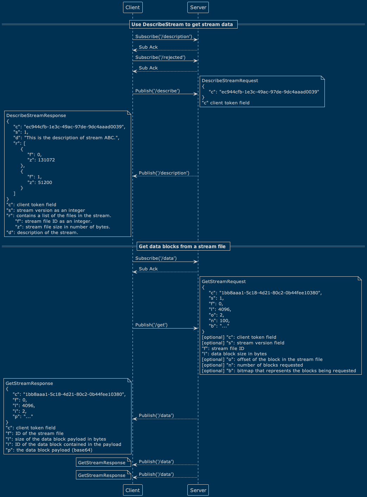
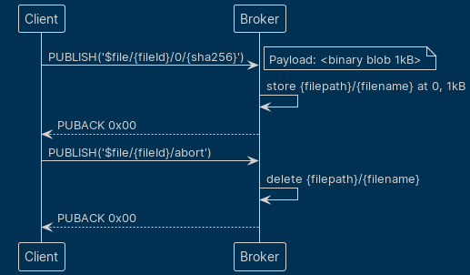

# File transfer over MQTT

## Changelog

* 2022-09-20: @qzhuyan, @id, @zmstone Initial draft

## Abstract

This documents defines protocol to send files from MQTT clients to MQTT server. It is using only PUBLISH and PUBACK messages and does not require MQTT 5.0 features like topic aliases.

## Motivation

EMQX customers are asking for file transfer functionality from IoT devices to their cloud (primary use case), and from cloud to IoT devices over MQTT. Right now they are uploading files from devices via FTP or HTTPS (e.g. to S3), but this approach has downsides:

* FTP and HTTP servers usually struggle to keep up with large number of simultaneous bandwidth-intensive connections
* packet loss or reconnect forces clients to restart the transfer
* devices which already talk MQTT need to integrate with one more SDK, address authenticaion and authorization, and potentially go through an additional round of security audit

Known cases of device-to-cloud file transfer:

* [CAN bus](https://en.wikipedia.org/wiki/CAN_bus) data
* Image taken by industry camera for Quality Assurance
* Large data file collected from forklift
* Video and audio data from truck cars, and video data captured by inbound unloading cameras
* Vehicle real-time logging, telemetry, messaging
* Upload collected ML logs

Known cases of cloud-to-device file transfer:

* Upload AI/ML models
* Firmware upgrades

Even though devices could already send binary data in MQTT packets, it is not trivial to guarantee reliable file transfer without clear expectations from client and server side.

## Terminology

The key words "MUST", "MUST NOT", "REQUIRED", "SHALL", "SHALL NOT", "SHOULD", "SHOULD NOT", "RECOMMENDED", "NOT RECOMMENDED", "MAY", and "OPTIONAL" in this document are to be interpreted as described in [BCP 14](https://www.rfc-editor.org/bcp/bcp14) [[RFC2119](https://www.rfc-editor.org/rfc/rfc2119)] [[RFC8174](https://www.rfc-editor.org/rfc/rfc8174)] when, and only when, they appear in all capitals, as shown here.

The following terms are used as described in [MQTT Version 5.0 Specification](https://docs.oasis-open.org/mqtt/mqtt/v5.0/os/mqtt-v5.0-os.html):
* Application Message
* Server
* Client
* Topic
* Topic Name
* Topic Filter
* MQTT Control Packet

*At least once*: a message can be delivered many times, but cannot be lost

## Requirements

* The protocol MUST use only PUBLISH type of MQTT Control Packet
* The protocol MUST support transfer of file segments
* Server MUST be able to verify integrity of each file segment and of the whole file
* Client MAY know total file size when initiating the transfer
* Client MAY abort file transfer
* Server MAY ask the client to pause file transfer
* Server MAY ask the client to abort file transfer
* The protocol MUST guarantee "At least once" delivery
* Server MUST NOT support subscription on topics dedicated for file transfer

## AWS IoT MQTT-based file delivery (reference design)

As an example of existing implementation we can look at AWS IoT Core [which provides functionality](https://docs.aws.amazon.com/iot/latest/developerguide/mqtt-based-file-delivery.html) to [deliver files to IoT devices](https://docs.aws.amazon.com/iot/latest/developerguide/mqtt-based-file-delivery-in-devices.html):

## Design

### Overview

* Files are split in segments, segments can be of arbitrary length
* Client MUST generate UUID according to [RFC 4122](https://www.rfc-editor.org/rfc/rfc4122) for each file being transferred and use it as file Id in Topic Name
* Broker MUST validate that provided UUID conforms to [RFC 4122](https://www.rfc-editor.org/rfc/rfc4122)
* Client MAY calculate SHA-256 checksum of the segment it's about to send and send it as part of Topic Name
* Client MAY calculate SHA-256 checksum of the file it's about to send and include it in the `init` message payload or send is as part of the `fin` message
* If Client chooses to provide checksum for file segments, whole file, or both, it MUST use [SHA-256](https://www.rfc-editor.org/rfc/rfc6234)
* If checksum is included in the `init` message payload, the Broker MUST use it to verify integrity of the file after receving the `fin` message for the corresponding file transfer
* If checksum is included in topic name, Broker MUST use it to verify integrity of corresponding data:
  * segment, if it's a segment transfer message
  * whole file, if it's a `fin` message
* If checksum verification fails, Broker MUST reject the corresponding data
* Client MUST use $file Topic to transfer files
* Broker MUST NOT let clients subscribe to $file topics
* Segment length can be calculated on the server side by subtracting the length of the [Variable Header](https://docs.oasis-open.org/mqtt/mqtt/v5.0/os/mqtt-v5.0-os.html#_Toc3901025) from the [Remaining Length](https://docs.oasis-open.org/mqtt/mqtt/v5.0/os/mqtt-v5.0-os.html#_Toc3901105) field that is in the [Fixed Header](https://docs.oasis-open.org/mqtt/mqtt/v5.0/os/mqtt-v5.0-os.html#_Toc3901021)
* Data is transferred in PUBLISH packets in the following order:
  1. $file/{fileId}/init
  2. $file/{fileId}/{offset}[/{checksum}]
  3. $file/{fileId}/{offset}[/{checksum}]
  4. ...
  3. $file/{fileId}/[fin[/{checksum}] | abort]

#### `$file/{fileId}/init` message

Initialize the file transfer. Server is expected to store metadata from the payload in the session along with `{fileId}` as a reference for the rest of file metadata.

  * Qos=1
  * Payload Format Indicator=0x01
  * `{fileId}` is corresponding file UUID
  * Payload is a JSON document

##### `init` payload JSON Schema

Available [here](https://github.com/emqx/mqtt-file-transfer-schema/blob/v1.0.0/init.json).

* Broker SHOULD have default setting for `segments_ttl`
* Broker MAY delete segments of unfinished file transfers when their TTL has expired

#### `$file/{fileId}/{offset}[/{checksum}]` message

One such message for each file segment.

  * Qos=1
  * Payload Format Indicator=0x00
  * Payload is file segment bytes
  * `{offset}` is byte offset of the given segment
  * optional `{checksum}` is SHA-256 checksum of the file segment

#### `$file/{fileId}/fin[/{checksum}]` message

All file segments have been successfully transferred.

  * Qos=1
  * no payload
  * optional `{checksum}` is SHA-256 checksum of the file

#### `$file/{fileId}/abort` message

Client wants to abort the transfer.

  * Qos=1
  * no payload

### PUBACK Reason codes

| Reason code | MQTT Name                     | Meaning in file transfer context                    |
|-------------|-------------------------------|-----------------------------------------------------|
| OMIT        |                               | Same as 0x00                                        |
| 0x00        | Success                       | File segment has been successfully persisted        |
| 0x10        | No matching subscribers       | Server asks Client to retransmit all segments       |
| 0x80        | Unspecified error             | For segment transmission, Server asks Client to retransmit the segment. For `fin`, Server asks Client to retransmit all segments |
| 0x83        | Implementation specific error | Server asks Client to cancel the transfer           |
| 0x97        | Quota exceeded                | Server asks Client to pause the transfer            |

#### 0x97, "Quota exceeded", "Pause Transfer"

Client is expected to wait before trying to retransmit file segment again.

### PUBACK from MQTT servers < v5.0

PUBACK messages prior to MQTT v5.0 do not carry Reason code, it's up to the Client to decide if, when and how to retry.

### Happy path

### Transfer abort initiated by client

### Transfer restart initiated by server

## Backwards Compatibility

Full backward compatibility with MQTT 5.x and MQTT 3.x.

## Innovation Opportunities

* Integration with rule engine
* Pluggable storage backends
* Multiple backend writes to a single file
* Do the entire MQTT message logging
* QUIC pure binary stream support
* ACL enables client-side control of file size
* Bulk upload at EMQX
* Multi-node local cache utilization similar to hdfs
* Cheaper (in computational costs) checksum algorithm
* Server-to-client file transfer protocol

## Declined Alternatives

* Use of MQTT extension headers
  * Poor compatibility and complex application layer implementation
* Capability negotiation
  * Poor client compatibility, complex application layer implementation
* Client supplied file name as file identifier instead of UUID
  * potential security issues
  * potential name clashing issues
* checksum value instead of UUID
  * will not work if client does not have full file when initiating the transfer
* checksum as part of the payload, not as part of topic name
  * Requires specification for payload serialization format leading to more complicated client code
* File segment offset as part of the payload
  * Same as above, Requires specification for payload serialization format and more complicated code
* Using constant segment size (per file) and sequential segment number instead of byte offset to reduce packet size
  * Clients may want to change segment size dynamically to account for changes in network properties (e.g. moving from faster to slower and spotty network, or vice versa)

