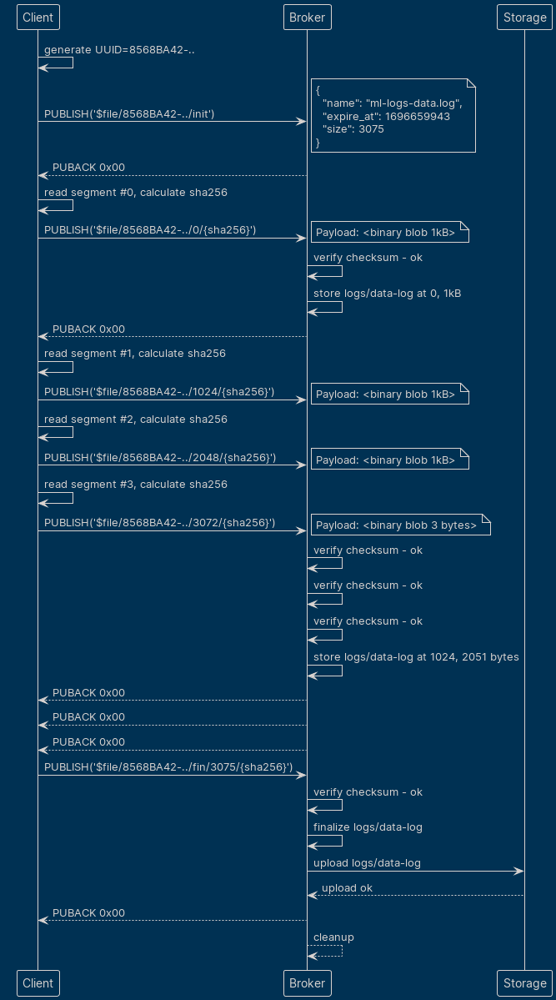
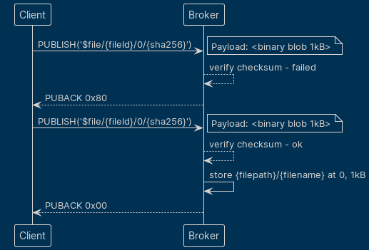

# MQTT based file transfer

## Changelog

* 2022-09-20: @qzhuyan, @id Initial draft

## Abstract

TODO:

## Motivation

EMQX customers are asking for file transfer functionality from IoT devices to their cloud (primary use case), and from cloud to IoT devices over MQTT. Right now they are uploading files from devices via FTP or HTTPS (e.g. to S3), but it's not working well. For example, both FTP and HTTP servers usually struggle to keep with large number of simultaneous bandwith-intensive connections. Another issue is that uploading files over weak/spotty/unreliable network is not a good experience due to frequent connection reset and transfer restarts.

Device-to-cloud file transfer use cases:

* [CAN bus](https://en.wikipedia.org/wiki/CAN_bus) data
* Image taken by industry camera for Quality Assurance
* Large data file collected from forklift
* Video and audio data from truck cars, and video data captured by inbound unloading cameras
* Vehicle real-time logging data and messaging
* ML logs

Cloud-to-device file transfer use cases:

* AI/ML models
* Firmware upgrades

With EMQX, Customers can transfer real-time IoT data (e.g. structured, as well as unstructured IoT, sensor, and industrial data), and will also support offline types of bulk data transfer (video, audio, images,  compressed log files, etc.), which, combined with EMQX's rules engine, will make it extremely easy for users to connect any IoT data to the cloud.

## Requirements

* Simultaneous transfer of MQTT and various types of files over a single network connection
* Separate data transfer and file transfer channels to achieve non-blocking transmission
  * Channel priority setting, specify the priority of different channels according to customer requirements
  * Channels can cooperate with each other to achieve overall flow control
  * Multiple channels can be specified for file transfer at the same time to increase file transfer parallelism
* Efficient transmission support in weak network
  * File transfer in weak networks such as Telematics and mobile
  * Automatic file chunking, block-based granularity breakpoint transfer (or file-level breakpoint transfer?)
  * Switch to TCP if QUIC is not available

## AWS IoT MQTT-based file delivery (reference design)

As an example of existing implementation we can look at AWS IoT Core [which provides functionality](https://docs.aws.amazon.com/iot/latest/developerguide/mqtt-based-file-delivery.html) to [deliver files to IoT devices](https://docs.aws.amazon.com/iot/latest/developerguide/mqtt-based-file-delivery-in-devices.html):

## Design

In the first phase we are going to focus on limited scope:

* device-to-cloud file transfer only
* reusing existing TCP connection
* push only, i.e. broker cannot request file transfer, but device can start sending files any time
* device may not know total file size when starting the transfer

### Requirements

* Based on the MQTT protocol. Use MQTT messages to encapsulate file bodies
* Transport layer TCP, TCP/TLS and QUIC (TCP fallback) multiplexing connections with other service topics​
* High concurrency (multiple uploads in progress)
* MQTT Client single/bi-directional transfer (active file upload, passive file download)
* Fault tolerance: disconnected retransmission (sender side)
* Fragmentation: (multi parts, fragments)
* Multi-channel: multiple TCP connections, QUIC multi-streams
* Cancellation: Both parties can pause or cancel the transfer, and an event notification is required when the transfer is complete. (How to notify? What is the target of the notification?)
* Minimal code changes on Client side, SDK support available. (low code/no code)
* Minimize data retransmission, and reduce network pressure and bandwidth usage.
* RestAPI interface Query transfer status
* EMQX local incomplete file cache
* Client API should be easy to use: easy to migrate from existing applications (ftp, nfs, s3)
* File body Encryption and decryption (with external key management)?

### Out of scope

* Non-reliable transmission is not supported
* No support for one-to-many transfers
* No distributed cache storage
* Broker does not aware of interrupted transfer, It will be client-side implementation

### Limitations

* File transfer is PUSH mechanism but not support POLL, the receiving side cannot request to initiate the transfer
decisions of the size of a slice cannot be as natural as streaming.
* Due to network bandwidth limitations, it may happen that multiple files are transferred in parallel but all fail to complete the transfer in the desired time.
* Do not get too hung up on the length of the topic and do not take advantage of "topic alias" (MQTT 5.0)
* Performance may be limited by disk IO (network in speed > disk out speed)
* Overwrite existing file SEG
* Linux filename length 255 bytes. path_max 4096
* EMQX terminates file transfers, file message MQTT forwarding (as proxy) is not required.
* QUIC in EMQX does not support HTTP/3 protocol, old client supports HTTP upload, how to smooth migration?

### Protocol design

* Maximum bandwidth utilization, high signal-to-noise ratio (DATA/ MQTT HEADER)
* Asynchronous stateless non-continuous transfer, sliceable, messy (retransmission after disconnection) (parallel transfer of multiple files)
* Fault tolerance.
  * Incomplete packets Disconnected.
  * Transmission can be paused or resumed for a long time
  * Interactive completions required???
* Local caching of file contents
* Utilizes only MQTT topic and payload (Payload Format Indicator?). No header changes.
* TCP multi-connection support (using Same Client ID)
* User could manipulate file names, and paths. (blacklist/check file names/path, or relative path only)
* Symmetric transfer (client -> broker)
* PUBACK (QoS) guarantees transmission reliability (considering that the client does not receive PUBACK and resends it after disconnection)?

### Happy path

### Transfer abort initiated by device

### Transfer restart initiated by broker

### Reason codes in messages from broker

| Reason code | MQTT Name                     | Packet | Meaning in file transfer context                    |
|-------------|-------------------------------|--------|-----------------------------------------------------|
| OMIT        |                               |        | Same as 0x00                                        |
| 0x00        | Success                       | PUBACK | The content of the Publish message is persisted     |
| 0x10        | No matching subscribers       | PUBACK | Receiver asks Sender to restart the transfer from 0 |
| 0x83        | Implementation specific error | PUBACK | Receiver asks to cancel the transfer                |
| 0x97        | Quota exceeded                | PUBACK | Receiver asks to pause the transfer. Retry logic shall be agreed/configured before hand |

## Configuration Changes

This section should list all the changes to the configuration files (if any).

## Backwards Compatibility

This sections should shows how to make the feature is backwards compatible.
If it can not be compatible with the previous emqx versions, explain how do you
propose to deal with the incompatibilities.

## Document Changes

If there is any document change, give a brief description of it here.

## Testing Suggestions

The final implementation must include unit test or common test code. If some
more tests such as integration test or benchmarking test that need to be done
manually, list them here.

## Innovation Opportunities

* Integration with rule engine
* Support for more back-end, database writes
* Multiple backend writes to a single file
* Support for rules processing of metadata
* Generate modified properties of target files based on file metadata and rules of rules engine
* Trigger event data when file upload starts/completes Enter rule chain for rule engine
* Do the entire MQTT message logging
* QUIC pure binary stream support
* ACL enables client-side control of file size
* Bulk upload at EMQX
* Multi-node local cache utilization similar to hdfs

## Declined Alternatives

* Use of MQTT extension headers
  * Poor compatibility and complex application layer implementation
* Only supports QUIC protocol
  * Always need to support fallback to TCP so TCP needs to be supported as well
* Capability negotiation
  * Poor client compatibility, complex application layer implementation
* Front-end implementation is directly integrated into the rule engine
  * Rule engine is too complex and not applicable in the case of few types of backend support, only the configuration part can be seen to be reused.

